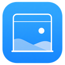

# LookAway



一个简洁的 macOS 菜单栏应用，提醒你定时休息眼睛。

## 功能

- **菜单栏倒计时**：在菜单栏实时显示剩余工作时间。
- **强制休息模式**：到点自动全屏遮挡，休息结束前无法跳过或退出应用。
- **多种显示模式**：图标+时间、仅时间、极简图标，随心切换。
- **声音提醒**：休息结束时播放提示音。
- **登录时启动**：开机自动运行，不忘记休息。

## 安装

1. 从 [Releases](https://github.com/0x727A/lookaway/releases) 下载最新版 `LookAway-1.0.2.dmg`。
2. 打开 DMG，将 `LookAway.app` 拖到**应用程序**文件夹。
3. 首次启动请在**系统设置 > 隐私与安全性**中允许打开。

## 使用

- 点击菜单栏图标查看倒计时与操作菜单。
- 选择**设置...**调整工作/休息时长、是否强制休息、显示模式等。
- 到点时应用会自动弹出休息窗口。
- 强制休息模式下，休息结束前 `Command + Q` 与菜单退出均不可用。

## 系统要求

- macOS 13.0 或更高版本

## 开发构建

```bash
swift build -c release
cp .build/release/LookAway LookAway.app/Contents/MacOS/LookAway
```

## License

MIT
